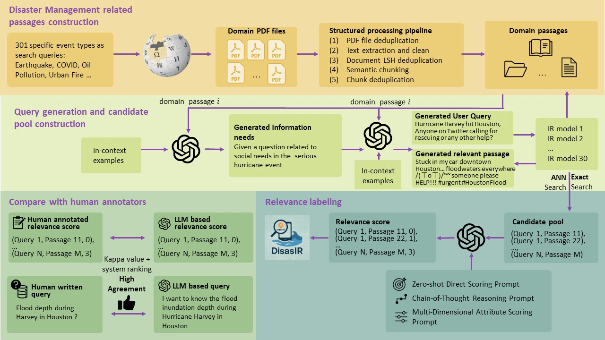

# DisastIR: A Comprehensive Information Retrieval Benchmark for Disaster Management.
---
The source code for **DisastIR: A Comprehensive Information Retrieval Benchmark for Disaster Management.**
---

## 📑 Table of Contents
1. [Introduction](#introduction)
1. [Leaderboard](#%F0%9F%93%88-leaderboard)  
2. [Overview](#-overview)  
3. [Directory Structure](#-directory-structure)  
4. [Installation](#️-installation)  
5. [Configuration](#⚙️-configuration)  
6. [Pipeline Steps](#-pipeline-steps)  
   - [1. Build Corpus](#1-build-corpus)  
   - [2. Generate Queries](#2-generate-queries)  
   - [3. Build Label Pool](#3-build-label-pool)  
   - [4. Relevance Scoring](#4-relevance-scoring)  
7. [Viewing Results](#📈-viewing-results)  
8. [Tips](#📝-tips)  

---
## 📘 Introduction
Effective disaster management requires timely access to accurate and contextually relevant information. Existing Information Retrieval (IR) benchmarks, however, focus primarily on general or specialized domains, such as medicine or finance, neglecting the unique linguistic complexity and diverse information needs encountered in disaster management scenarios. To bridge this gap, we introduce \textbf{DisastIR}, the first comprehensive IR evaluation benchmark specifically tailored for disaster management. DisastIR comprises 9,600 diverse user queries and more than 1.3 million labeled query-passage pairs, covering 48 distinct retrieval tasks derived from six search intents and eight general disaster categories that include 301 specific event types. Our evaluations of 30 state-of-the-art retrieval models demonstrate significant performance variances across tasks, with no single model excelling universally. Furthermore, comparative analyses reveal significant performance gaps between general-domain and disaster management-specific tasks, highlighting the necessity of disaster management-specific benchmarks for guiding IR model selection to support effective decision-making in disaster management scenarios.




## 📈 Leaderboard

| Model Name                        | Params | Bin   | QA    | QAdoc | TW    | FC    | NLI   | STS   | Exact Avg | ANN Avg |
|-----------------------------------|:------:|:-----:|:-----:|:-----:|:-----:|:-----:|:-----:|:-----:|:---------:|:--------:|
| **inf-retriever-v1**              | 7 B    | XL    | 74.23 | 67.82 | 69.33 | 68.91 | 53.10 | 77.70 | 68.52     | 66.90     |
| SFR-Embedding-Mistral             | 7 B    | XL    | 71.76 | 67.58 | 70.42 | 70.62 | 50.86 | 73.61 | 67.47     | 66.75     |
| inf-retriever-v1-1.5b             | 1.5 B  | XL    | 70.64 | 64.42 | 66.11 | 66.53 | 53.86 | 76.19 | 66.29     | 65.54     |
| **NV-Embed-v2**                   | 7 B    | XL    | 74.77 | 69.74 | 43.18 | 68.64 | 58.73 | 77.01 | 65.34     | 64.45     |
| **multilingual-e5-large**         | 560 M  | Large | 67.29 | 64.25 | 63.75 | 60.26 | 51.02 | 75.06 | 63.61     | 62.08     |
| multilingual-e5-large-instruct    | 560 M  | Large | 68.39 | 64.90 | 63.24 | 67.21 | 49.38 | 64.31 | 62.91     | 62.06     |
| **e5-small-v2**                   | 33 M   | Small | 65.87 | 63.00 | 60.89 | 62.04 | 47.09 | 74.83 | 62.29     | 60.91     |
| e5-base-v2                        | 109 M  | Med.  | 65.77 | 63.07 | 58.37 | 62.28 | 45.54 | 74.64 | 61.61     | 60.23     |
| e5-large-v2                       | 335 M  | Large | 60.15 | 63.42 | 56.20 | 62.29 | 50.96 | 74.99 | 61.34     | 60.20     |
| NV-Embed-v1                       | 7 B    | XL    | 68.36 | 63.02 | 56.84 | 60.04 | 48.31 | 67.86 | 60.74     | 59.24     |
| granite-embedding-125m            | 125 M  | Med.  | 64.90 | 61.04 | 47.14 | 62.78 | 48.04 | 71.94 | 59.31     | 58.67     |
| llmrails-ember-v1                 | 335 M  | Large | 64.82 | 63.34 | 45.93 | 61.06 | 44.56 | 73.99 | 58.95     | 58.35     |
| arctic-embed-m-v2.0               | 305 M  | Med.  | 61.44 | 62.50 | 47.80 | 58.04 | 42.34 | 65.28 | 56.23     | 54.75     |
| mxbai-embed-large-v1              | 335 M  | Large | 64.57 | 62.96 | 40.58 | 58.47 | 40.22 | 68.81 | 55.93     | 55.42     |
| gte-base-en-v1.5                  | 137 M  | Med.  | 60.66 | 56.06 | 47.06 | 52.49 | 39.88 | 71.27 | 54.57     | 53.71     |
| gte-large-en-v1.5                 | 434 M  | Large | 67.70 | 58.55 | 40.31 | 53.09 | 34.81 | 67.30 | 53.63     | 53.09     |
| snowflake-arctic-embed-l-v2.0     | 568 M  | Large | 55.34 | 59.43 | 38.75 | 60.42 | 41.19 | 63.38 | 53.09     | 51.90     |
| bge-base-en-v1.5                  | 109 M  | Med.  | 49.67 | 53.97 | 47.03 | 58.47 | 35.58 | 64.43 | 51.52     | 50.71     |
| bge-large-en-v1.5                 | 335 M  | Large | 57.02 | 54.72 | 32.71 | 55.22 | 35.19 | 65.14 | 50.00     | 48.99     |
| gte-Qwen2-7B-instruct             | 7 B    | XL    | 62.47 | 39.12 | 41.40 | 29.98 | 47.28 | 70.98 | 48.54     | 47.07     |
| bge-small-en-v1.5                 | 33 M   | Small | 47.38 | 45.51 | 27.82 | 52.13 | 27.20 | 56.86 | 42.82     | 42.07     |
| snowflake-arctic-embed-m-v1.5     | 109 M  | Med.  | 25.73 | 30.56 | 18.31 | 48.24 | 43.04 | 64.95 | 38.47     | 36.25     |
| snowflake-arctic-embed-s          | 33 M   | Small | 36.05 | 27.46 | 18.17 | 42.52 | 37.27 | 66.59 | 38.01     | 33.59     |
| snowflake-arctic-embed-l          | 335 M  | Large | 40.82 | 30.41 | 15.32 | 32.70 | 34.62 | 56.82 | 35.11     | 31.35     |
| Linq-Embed-Mistral                | 7 B    | XL    | 35.61 | 31.41 | 26.55 | 39.46 | 27.30 | 45.69 | 34.34     | 33.52     |
| thenlper-gte-base                 | 109 M  | Med.  |  9.22 |  5.35 | 38.54 | 60.80 | 42.85 | 46.64 | 33.90     | 31.78     |
| snowflake-arctic-embed-m          | 109 M  | Med.  | 33.35 | 14.25 |  8.64 | 35.30 | 38.93 | 56.88 | 31.23     | 28.83     |
| all-mpnet-base-v2                 | 109 M  | Med.  | 15.06 |  9.77 | 16.17 | 46.30 | 27.38 | 37.23 | 25.32     | 25.05     |
| e5-mistral-7b-instruct            | 7 B    | XL    | 21.65 | 19.51 | 19.48 | 31.04 | 20.39 | 39.57 | 25.27     | 24.05     |
| gte-Qwen2-1.5B-instruct           | 1.5 B  | XL    | 13.98 | 22.21 | 19.61 | 23.90 | 18.00 | 31.20 | 21.48     | 21.27     |
---

## 🔍 Overview

1. **Corpus Construction**  
   - Download disaster management-related PDFs.  
   - Extract and clean text.  
   - Deduplicate at the file and chunk level.  
   - Semantic chunking into passages.

2. **Query Generation**  
   - Passage-level tasks: Twitter, QA, STS, Fact-Check, NLI.  
   - Document-level QA.

3. **Retrieval & Label Pool**  
   - Encode corpus & queries with dense models.  
   - Build ANN indices, perform exact & approximate retrieval.  
   - Merge top-K results into `label_pool.json`.

4. **Relevance Scoring**  
   - Rate each (query, passage) pair via three LLM-based raters:  
     - Four-phase decomposed  
     - Chain-of-Thought  
     - Zero-Shot  
   - Aggregate scores (majority vote, average).

---

## 📂 Directory Structure

```
DisastIR/
├── README.md
├── requirements.txt
├── configs/
│   ├── path_config.py      # all paths
│   ├── model_config.py     # model names, device, batch sizes
│   └── gen_config.py       # LLM settings, prompt templates
├── data/
│   ├── raw_pdf/
│   ├── txt_cleaned/
│   ├── deduped_chunks/
│   ├── embeddings/
│   └── label_pools/
├── outputs/
│   ├── scores/
│   └── results/
├── scripts/
│   ├── build_corpus.py
│   ├── generate_queries.py
│   ├── build_label_pool.py
│   └── relevance_scoring.py
└── src/
    ├── __init__.py
    ├── corpus/             # downloader, manager, processor, chunker, deduper
    ├── query/              # client, generators, pipeline
    ├── retrieval/          # embedder, index_builder, retriever, label_pool_builder
    ├── scoring/            # scorer + raters
    └── utils/              # embedding, llm, io, misc helpers
```

---

## 🛠️ Installation

1. **Clone & enter project**  
   ```bash
   git clone https://<your-repo>.git
   cd DisastIR
   ```

2. **Create a Python 3.10+ virtual env**  
   ```bash
   python -m venv .venv
   source .venv/bin/activate
   ```

3. **Install dependencies**  
   ```bash
   pip install -r requirements.txt
   ```

4. **Set your OpenAI API key**  
   Edit `configs/gen_config.py`:
   ```python
   OPENAI_API_KEY = "sk-..."
   ```

---

## ⚙️ Configuration

All paths and constants are centralized:

- **`configs/path_config.py`**  
- **`configs/model_config.py`**  
- **`configs/gen_config.py`**

---

## 🚀 Pipeline Steps

### 1. Build Corpus

```bash
python scripts/build_corpus.py   --keywords_json path/to/keywords.json
```

**Input:**  
- `--keywords_json`: JSON array of disaster-related search keywords, e.g.:

  ```json
  [
    "Civil unrest",
    "Earthquake",
    "Building collapse"
  ]
  ```

**Output:**  
1. **Downloaded PDFs**  
   - `data/raw_pdf/{keyword}/file_X.pdf`  
2. **Extracted & Cleaned Text**  
   - `data/txt_cleaned/{keyword}_txt/*.txt` (and `.csv` for tables)  
3. **File-level Deduplication**  
   - Unique: `data/deduped_txt/`  
   - Duplicates: `data/dup_txt/`  
4. **Semantic Chunking**  
   - `data/chunks_json/chunks_<batch>.json`, each record:
     ```json
     {
       "page_content": "...",
       "specific_type": "Hazardous waste",
       "general_type": "Chemical",
       "source": "file_1",
       "id": 1
     }
     ```
5. **Embedding-level Deduplication**  
   - `data/deduped_chunks/deduped_<batch>.json`

---

### 2. Generate Queries

```bash
python scripts/generate_queries.py --tasks all --filename chunks_001.json --start_index 0 --end_index 100
```

**Passage-level Query Generation**

**Input:**

1. **Chunk Files**  
   Directory: `data/deduped_chunks/`  
   Each file (e.g. `chunks_001.json`) is a JSON list of chunk objects:
   ```json
   [
     {
       "page_content": "Floods are the most common natural disaster ...",
       "specific_type": "Flood",
       "general_type": "WaterHazard",
       "source": "doc1",
       "id": 1
     },
     {
       "page_content": "Emergency kits should include ...",
       "specific_type": "Preparedness",
       "general_type": "Safety",
       "source": "doc1",
       "id": 2
     }
   ]
   ```
2. **Prompt Templates**  
   Defined in `configs/gen_config.py` or external JSON at `PROMPTS_FILE`.
3. **OpenAI Client & Tokenizer**  
   Configured with `OPENAI_API_KEY` and the specified model.

**Output (Passage-level):**

- Batch files under `data/test_queries/`, named:
  ```
  chunks_001_batch_001.json
  chunks_001_batch_002.json
  ...
  ```
- Each record includes original chunk fields plus task‐specific generated fields. Example for Twitter & QA:
  ```json
  {
    "page_content": "...",
    "specific_type": "Flood",
    "general_type": "WaterHazard",
    "source": "doc1",
    "id": 1,

    "Twitter_config": {
      "headline_1": { "task": "Generate a tweet about evacuation" }
    },
    "Twitter": {
      "query_1": "What should people do when floods rise?",
      "positive_tweet_1": "Stay informed via official channels...",
      "hard_negative_tweet_1": "I love rain!"
    },

    "QA_config": {
      "user_query_1": {
        "task": "Evacuation procedure",
        "query_length": "medium",
        "clarity": "clear",
        "difficulty": "easy",
        "num_words": 20
      }
    },
    "QA": {
      "user_query_1": "How do I evacuate safely during a flood?",
      "positive_document_1": "First, gather your essentials...",
      "hard_negative_document_1": "Floods are fun!"
    }
  }
  ```

**Document-level Query Generation**

- Include `doc` in `--tasks`.
- Outputs under `data/document_queries/`, e.g. `doc_batch_001.json`:
  ```json
  {
    "user_query": "What is the recommended evacuation radius?",
    "positive_document": "In case of a chemical spill, evacuate to at least 1 mile away...",
    "doc_title": "Chemical Spill Response Guide",
    "source": "doc2"
  }
  ```
---

### 3. Build Label Pool

The Build Label Pool step merges retrieval results into a label pool for each query set.

**Input:**

- **Query Files**: JSON files under `data/test_queries/`, each containing a list of records:
  ```json
  [
    {
      "user_query": "What are the evacuation procedures for floods?"
    },
    {
      "user_query": "How to prepare an emergency kit?"
    }
  ]
  ```
- **Query Embeddings**: NumPy `.npy` files under `data/query_embeddings/{model_name}/{filename}.npy`.
- **Corpora**: Ordered corpus JSON at `data/deduped_chunks/ordered_corpus.json`.

**Output:**

- **Label Pool Files**: For each query file `chunks_001.json`, produces `chunks_001_label_pool.json` under `data/label_pools/`. Each record is extended with `baseline_results` and `label_pool`:
  ```json
  [
    {
      "user_query": "What are the evacuation procedures for floods?",
      "baseline_results": {
        "infly_inf-retriever-v1_exact": [
          "Passage text A",
          "Passage text B"
        ],
        "infly_inf-retriever-v1_ann": [
          "Passage text C",
          "Passage text D"
        ]
      },
      "label_pool": [
        "Passage text A",
        "Passage text B",
        "Passage text C",
        "Passage text D"
      ]
    },
    ...
  ]
  ```

Run the script:
```bash
python scripts/build_label_pool.py
```

---

### 4. Relevance Scoring

```bash
python scripts/relevance_scoring.py   --task QA   --file_index 0   --part_index 0 
```

**Input:**  
- **Label Pool Files**: JSONs under `data/label_pools/`, each json item:
  ```json
  {
    "user_query": "What measures help contain hazardous waste leaks?",
    "label_pool": [
      "Passage A",
      "Passage B",
      ...
    ]
  }
  ```
- **Parameters:**  
  - `--task`: one of QA, FactCheck, NLI, STS, Twitter.  
  - `--file_index` / `--part_index`: slice into batches (`ITEMS_PER_PART`).  
  - `--force_default_prompts`: override prompts for FactCheck/NLI.

**Output:**  
- **Qrels Files**: `outputs/scores/{task}_..._qrels.json`. Each entry:
  ```json
  {
    "original_query": "...",
    "passage": "...",
    "score_phase4": 1,
    "score_cot": 2,
    "score_zero_shot": 3,
    "score_majority_vote": 2,
    "score_average": 2
  }
  ```
---

## 📈 Viewing Results

- **Raw scores**: `outputs/scores/<task>_…_qrels.json`  
- **Reports**: under `outputs/results`.
- **Benchmark release**: We will publicly release the full DisastIR benchmark after the anonymous review stage to support future research on disaster management-specific information retrieval models. 

---

## 📝 Tips

- Adjust `configs/*_config.py` for batch sizes, retrials.  
- Run in parallel by splitting `file_index`/`part_index`.  
- Monitor OpenAI usage for quotas.
